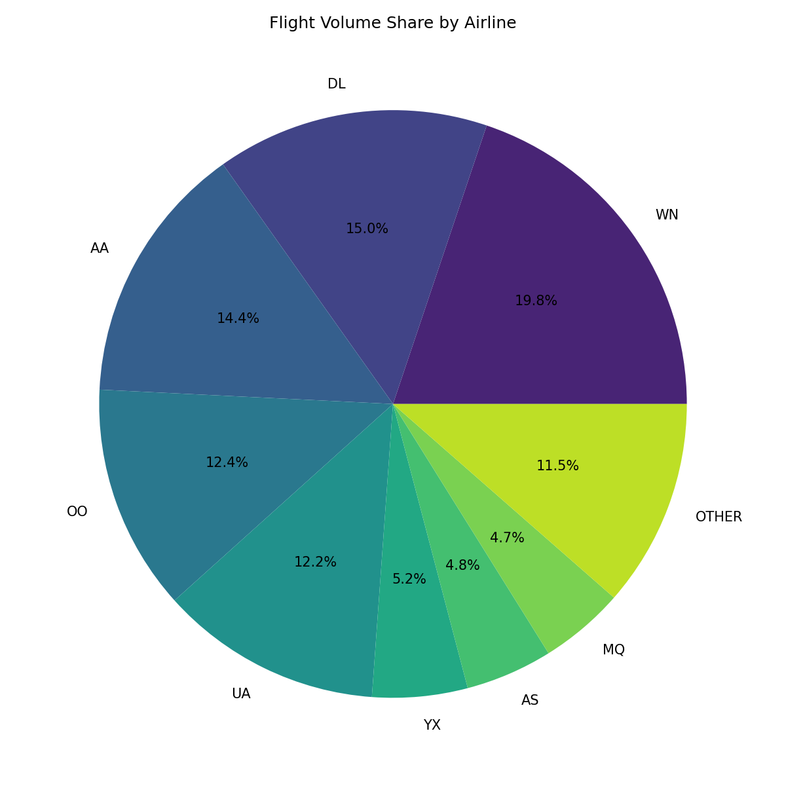
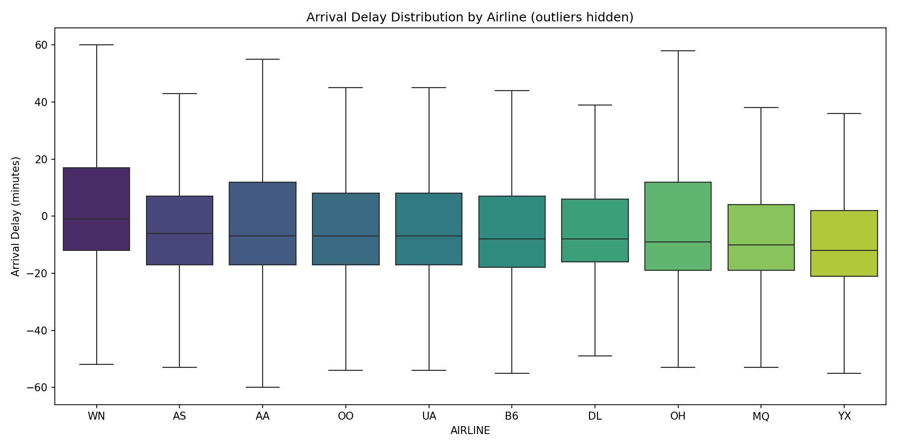
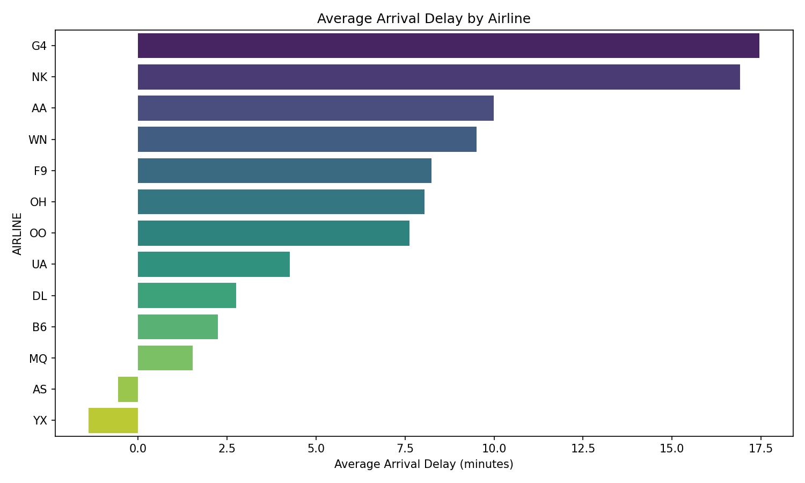
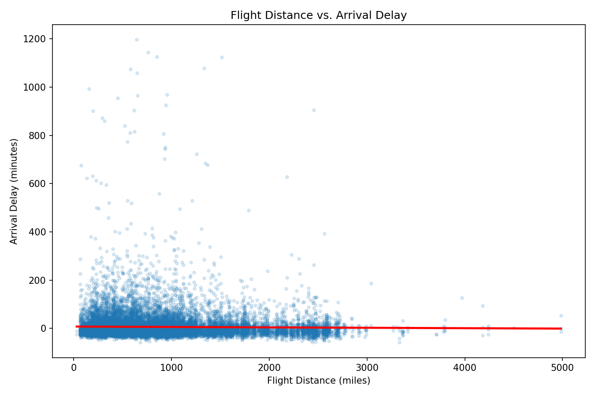
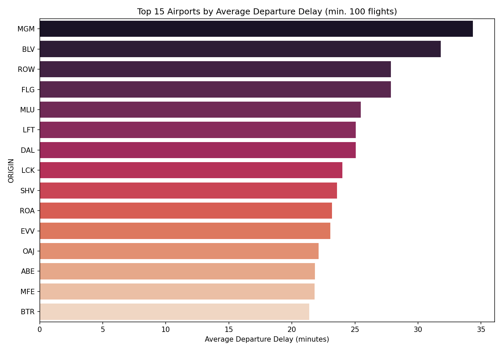

# U.S. Airline On-Time Performance Analysis

## Project Overview
Flight delays are a persistent pain point for both airlines and passengers, with cascading
effects on airport operations and connecting flights. This analysis uses the official
U.S. Department of Transportation's Reporting Carrier On-Time Performance dataset to
examine whether delays vary meaningfully by airline and by airport, and whether flight
distance plays a role.

## Dataset Information
The dataset was obtained directly from the U.S. DOT Bureau of Transportation Statistics:
https://www.transtats.bts.gov/Fields.asp?gnoyr_VQ=FGJ ("Reporting Carrier On-Time
Performance, 1987-present"). The raw table offers 111 available fields per flight record.

Out of 111 available fields, 8 core fields were selected for this analysis:

| Field | Reason for inclusion |
|---|---|
| FlightDate | Enables date-based pattern checks |
| Reporting_Airline | Primary variable being tested |
| Origin / Dest | Enables airport-level delay analysis |
| DepDelay / ArrDelay | Core outcome variables (delay in minutes) |
| Cancelled | Needed to exclude cancelled flights from delay calculations |
| Distance | Enables a secondary check of delay vs. flight length |

Fields excluded (TailNumber, WheelsOff/WheelsOn, TaxiIn/TaxiOut, diverted-airport detail
fields, etc.) were operational data unrelated to the delay-outcome question, and were left
out to keep the analysis focused and processing overhead low.

The dataset covers **May 2026** and initially consisted of **611,735 flight records**.

## Data Cleaning
1. Excluded 5,655 cancelled flights, since a cancelled flight has no valid delay value.
2. Dropped 1,734 rows with null departure/arrival delay values.
3. Removed 76 rows with implausible delay values (beyond -60 to +1440 minutes), treated as
   likely data entry errors.
4. After cleaning, **604,270 records** remained for analysis (1.22% overall rejection rate).

## Research Questions Analysed
1. Is there a significant difference in average arrival delay across airlines?
2. Which specific airlines differ most, and how large is that difference in practical terms?
3. Which airports have the highest average departure delays?
4. Is there a relationship between flight distance and arrival delay?

## Statistical Analysis Performed
Descriptive statistics (pie chart, boxplot, bar charts) were used to understand flight
volume share and delay distributions across airlines and airports.

A one-way **ANOVA** was performed to test whether mean arrival delay differs significantly
across airlines.

An **independent samples t-test** was performed between the best- and worst-performing
airlines to quantify the size and significance of that specific difference, including
Cohen's d for effect size and a 95% confidence interval for the difference in means.

A **Pearson correlation** was calculated between flight distance and arrival delay to test
whether longer flights are more or less prone to delay.

## Interpretations of Results

### Flight Volume by Airline


Southwest (WN) carries the largest share of flights in the dataset (19.8%), followed by
American (AA, 14.4%) and Delta (DL, 15.0%). This context matters for interpreting delay
findings — airlines with more flights have more opportunities for both on-time performance
and delays to appear in the data.

### ANOVA: Delay Differences Across Airlines
1. **ANOVA (F = 275.44, p < 0.001):** Significant difference in mean arrival delay exists
   across airlines.
2. This confirms that airline choice is not independent of expected delay — some carriers
   are systematically more delay-prone than others in this dataset.



The boxplot shows that while median delays are broadly similar and slightly negative
(flights arriving early) across most carriers, the spread and upper tail vary — some
airlines have wider delay distributions, consistent with more frequent significant delays.



### Independent Samples T-Test: Best vs. Worst Performing Airline
1. **T-test (t = -20.06, p < 0.001):** Allegiant (G4) has significantly higher average
   arrival delay than the best-performing carrier (YX).
2. **Effect Size (Cohen's d = 0.32):** A small-to-moderate effect size — the difference is
   statistically significant and practically noticeable, though not extreme at the
   individual-flight level.
3. **95% Confidence Interval:** The true average delay difference between these two
   carriers is estimated between **17.0 and 20.7 minutes**.
4. G4 (Allegiant) and NK (Spirit) — both budget carriers — show the highest average delays
   in this dataset, consistent with known industry patterns around budget-carrier scheduling
   and aircraft utilization.

### Flight Distance vs. Arrival Delay


1. **Pearson Correlation (r = -0.021):** A negligible relationship between flight distance
   and arrival delay.
2. This suggests that, contrary to a common assumption, longer flights are **not**
   meaningfully more prone to delay than shorter ones in this dataset — delay appears to be
   driven more by airline/airport-specific factors than by flight length.

### Airport-Level Delay Analysis


1. Montgomery Regional Airport (MGM) had the highest average departure delay (34.3 min) —
   **2.8x** the overall average across all airports (12.4 min).
2. Most of the highest-delay airports are smaller regional airports (e.g., BLV, ROW, FLG)
   rather than major hubs, though this should be interpreted cautiously given smaller
   sample sizes at these airports (see Limitations).

## Limitations
1. Analysis is based on a single month of data, so seasonal effects (e.g., winter weather
   delays, holiday travel volume) are not captured.
2. Delay causes (weather, carrier, air traffic system, security, late aircraft) were not
   analyzed in this phase — only the total delay outcome. A cause-level breakdown could be
   added as a follow-up using the CarrierDelay/WeatherDelay/NASDelay/SecurityDelay/
   LateAircraftDelay fields available in the same dataset.
3. Regional/route-level effects were not controlled for, so airline-level differences may
   partly reflect the routes each airline happens to fly.
4. Findings reflect domestic U.S. flights only and may not generalize to international routes.
5. The airport-level "highest delay" finding (MGM) is based on a relatively small sample
   (174 flights in this month), so it should be treated as a directional signal rather than
   a robust conclusion; a larger, multi-month sample would strengthen this specific finding.

## Key Findings / Observations
1. Airline choice matters: delays differ significantly by carrier (ANOVA p<0.001), with
   budget carriers (Allegiant, Spirit) showing the highest average delays.
2. The magnitude of the airline effect is real but moderate — Cohen's d of 0.32 between the
   best and worst carriers indicates a small-to-moderate practical effect, not an extreme one.
3. Flight distance is not a meaningful predictor of delay (r = -0.021) — delay appears
   driven by carrier- and airport-specific operational factors rather than flight length.
4. Smaller regional airports showed the highest average departure delays, though this
   finding carries more uncertainty due to smaller sample sizes.
5. Southwest, American, and Delta account for the largest share of flight volume in the
   dataset (~49% combined), providing useful context for interpreting airline-level results.

## How to Reproduce
```bash
pip install pandas scipy matplotlib seaborn --break-system-packages
python analyze.py
```
Place a BTS-downloaded CSV at `data/flights.csv` first (see Dataset Information above for
the exact source and field selections). Output charts and stats are written to `output/`.
